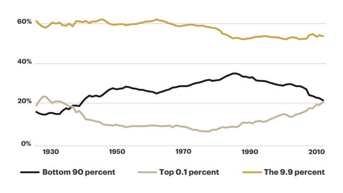
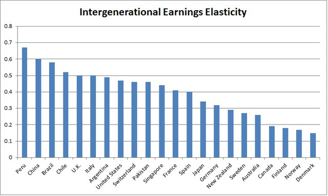
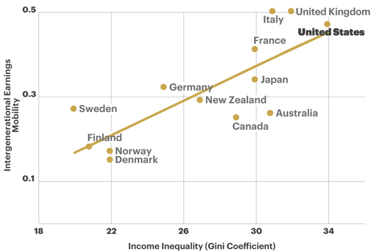

## Review ##

这周外文读后比较有感触的是 [新的贵族阶层的诞生](https://www.theatlantic.com/magazine/archive/2018/06/the-birth-of-a-new-american-aristocracy/559130/)，作者 MATTHEW STEWART，文章讨论美国的现阶段的阶级固化现象。

不同于20世纪初的贵族阶层（参考《了不起的盖茨比》），21世纪的新贵族阶层不再讲究与众不同的着装，不再恪守世代传递的家族信仰，不再一味的追求金钱财富的积累，新的贵族阶层更加的多元化，拥有更多的肤色和种族，个体也更加有文化和包容心，但这群新贵族阶层正在不知不觉的拉大美国的贫富差距，而随着社会各阶级的不断拉大，整体经济也将更加僵化，社会不平等的心理也会更主流，随着国家越来越不稳定，新的贵族阶层也会随之崩塌。

文章先是以数据分析了美国财富分布自1930年代以来的变化情况：

1980年左右，社会底层90%的人口占据的财富比例处历史最高，占据社会35%的财富，但之后，社会最富有的0.1%（约160，000人）的财富比例不断增加，但并不是剩下所有人分摊损失，只有底层的90%人口承受财富缩水，在0.1%比例的财阀抢占90%比例穷人财富的同时，剩下9.9%比例的富人一直稳稳占据整个社会财富的60%，超过其他两者财富总和。那这一比例的人有什么特点呢？这一比例的富人社会举止良好，受教育程度高，职业一般是律师、医生、牙医、中等规模的银行家等，工作头衔一般比较复杂。这一比例的人群，拒绝承认自己是富人，坚持称谓自己“中产阶级”。

这9.9比例的人口中大部分是白人，非裔和西裔分别占据这比例总人口的1.9和2.4，剩余其他种族占据比例8.8，考虑到非、西等其它少数种族占据整个美国人口的35%。可以说白人占据了绝对的致富优势。
而拥有多少财富就能加入这比例呢？2016年，门槛是120万美金，中位数240万，1000万进入0.9比例。一个财富是全美中位数的人需要多久才能加入这9.9俱乐部呢？在1963年，你需要扩展自己财富6倍，而到了2016年，你需要扩展12倍才能达到门槛，如果更贪婪一点，想要达到9.9比例的中位数，那么就需要扩展自己财富25倍了。以这种比例算法，2010年的数据和1920年代更加相似。我们都知道1929年美国的那次金融危机。有色人种的财富就更加的恶劣了，除却房子和汽车等固定资产，2013年，全美黑人家庭财富的中位数是1700美元，拉丁裔家庭中位数是2000美元，而白人家庭的财富中位数是116800美元。个别地区这个财富差距还会更大，以波士顿地区为例，2015年，白人家庭财富中位数高达247500美元，而黑人家庭中位数只有8美元（只够买两杯咖啡），理解为什么美国拍了那么多波士顿黑帮片了...

这些数据可能对于大部分人都不重要，因为世世代代美国人都信奉“美国梦”：只要经过努力不懈的奋斗便能获得更好的生活。财富的流动性会纠正财富的不平等，然而近几十年，财富流动性确变得越来越低。财富的变化是有弹性的，专业术语叫：代际收入弹性，英文IGE（intergenerational earnings elasticity）。大意如下面这幅图：

IGE具体意思是：父母和你之间有一个隐性的弹性带，如果你的父母在财富梯子的上面，那么就算你懒惰或者失败了，他们也会拉住你，如果你财富超过上一代，想继续上爬，那么弹性带会拖住你。IGE值0代表父母的财富和自己没有任何关系，IGE值1代表自己的财富完全来自于父母的财富。一般来说IGE越低代表社会财富流动性越大，IGE越高代表社会阶级固化越严重，国家为了提高社会稳定性，都会提高社会财富流动性，降低IGE，这也是欧洲国家收取高额遗产税的原因。下图为22个国家IGE的比较图：

所以说IGE值高的国家，一个人一生的财富基本上在一出生就决定了。当然一个国家的弹性系数在不同财富阶梯中也是不一样的，以美国为例，财富阶梯中间比例IGE只有0.2左右，而财富最高和最低阶段IGE确变得异常的高。

财富的流动性通常伴随着财富的不平等性，下图列举了部分国家两者关系的分布：

**待续...**

[Youtube: The 99% Is a Myth](https://www.youtube.com/watch?v=hb28kAavh0M)

## Algorithm ##

### Leetcode 上第二道题 ###
**题目：两个单向链表相加，每个元素是个位整数**

	Example
	
	Input: (2 -> 4 -> 3) + (5 -> 6 -> 4)
	Output: 7 -> 0 -> 8
	Explanation: 342 + 465 = 807.

**我的答题：**
	
	/**
	 * Definition for singly-linked list.
	 * struct ListNode {
	 *     int val;
	 *     ListNode *next;
	 *     ListNode(int x) : val(x), next(NULL) {}
	 * };
	 */
	class Solution {
	public:
	    ListNode* addTwoNumbers(ListNode* l1, ListNode* l2) {
	        ListNode *pCurrent = nullptr;
	        ListNode *pHead = nullptr;
	        ListNode *pPre = nullptr;
	        int overflow = 0;
	        
	        for (; l1 != nullptr || l2 != nullptr ; l1 = l1 == nullptr ? nullptr : l1->next, l2 = l2 == nullptr ? nullptr : l2->next) {
	            pCurrent = new ListNode(0);
	            if (pHead == nullptr) {
	                pHead = pPre = pCurrent;
	            } else {
	                pPre->next = pCurrent;
	            }
	            
	            int v1 = l1 == nullptr ? 0 : l1->val;
	            int v2 = l2 == nullptr ? 0 : l2->val;
	            int sum = v1 + v2 + overflow;
	            
	            pCurrent->val = sum % 10;
	            overflow = sum / 10;
	            
	            pPre = pCurrent;
	        }
	        
	        if (overflow > 0) {
	            pCurrent = new ListNode(overflow);
	            pPre->next = pCurrent;
	        }
	        
	        return pHead;
	    }
	};

**解答中的坑：**

* `for`循环中终止条件是`||`，那后面叠加`l1,l2`时一定不要忘记判断`nullptr`

## Tip ##

### Anko == Android(An) & Kotlin(Ko) ###

[官方链接](https://github.com/Kotlin/anko)

采用 Kotlin 开发 Android 应用程序，最直观的好处是代码精简了很多，而 Kotlin的亲儿子Anko库（同样JetBrains出品）则进一步将代码精简到底，那Anko库能做什么呢？

### Anko Commons ###

目前主要在 `Intents`(实用), `Dialogs,Toasts`(鸡肋), `Logging`(没用), `Resources,Dimensions`(实用) 这些场景内精简代码。

### Anko Layouts ###

抛弃Android原有的xml界面编写，采用DSL规则代码编写UI，支持插件预览界面，兼容原有xml界面。
例如：

	verticalLayout {
	    val name = editText()
	    button("Say Hello") {
	        onClick { toast("Hello, ${name.text}!") }
	    }
	}

个人感受：从原有xml过度到DSL有一定成本，而且目前DSL对UI属性支持还不完整，需要代码动态添加新的`View`时，可以尝试此DSL方案。

### Anko SQLite ###

已有项目的数据库方案比较难适配

### Anko Coroutines ###

`asReference` 和 `bg` 两个函数实用率比较高，可以抛弃Android原有的 `WeakReference` 和 `AsyncTask`。

## Share ##

关于Kotlin协程

    override fun onCreate(savedInstanceState: Bundle?) {
		super.onCreate(savedInstanceState)
		
		verticalLayout {
            val name = editText()
            button("Say Hello") {
                onClick { info("thread1: ${Thread.currentThread().id}") } // 打印 thread1: 1
            }
        }

        info("thread: ${Thread.currentThread().id}") // 打印 thread: 1

    }
    
上面例子中 `onClick` anko实现协程，按理说两个日志打印的`thread id`应该不一样，但是实际上是一样的，翻开源代码看：
	
	fun android.view.View.onClick(
	        context: CoroutineContext = UI,
	        handler: suspend CoroutineScope.(v: android.view.View?) -> Unit
	) {
	    setOnClickListener { v ->
	        launch(context) {
	            handler(v)
	        }
	    }
	}
	
**原来`onClick`的协程默认线程是UI线程**

那官网上这段话：

*Note that onClick() supports coroutines (accepts suspending lambda) so you can write your asynchronous code without explicit async(UI) call.*

是会误导用户在 `onClick` 函数内部添加阻塞操作的。