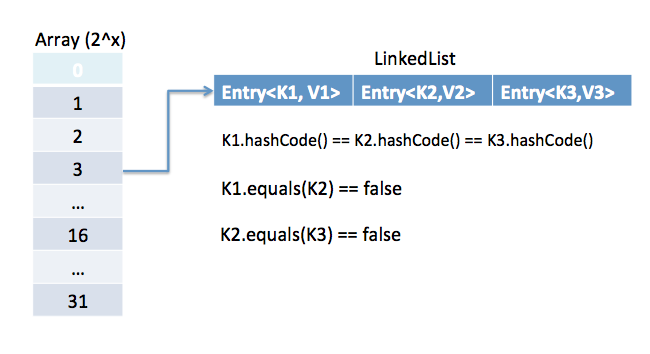
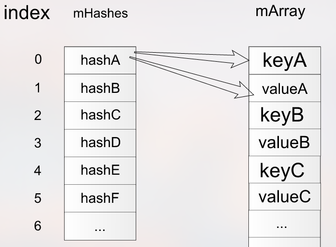

# Android中数据结构 #

## Map ##
只是接口，存放`key``value`映射结构，具体实现有 HashMap(JDK), ArrayMap(Android)

## HashMap ##
* 不是线程安全的
* 数据量大时，2倍扩展数组，耗费内存，可用ArrayMap和SparseArray代替
* 可以存放 null 键值对
* 不能存放相同key值
* 查询一个key,value的算法复杂度为：O(1)

### 原理 ###
* 数组 + 链表 结构，拉链法

Entry结构
	
		final K key;  
		final V value;  
		final int hash;  
		HashMapEntry<K, V> next;

* 初始化一个默认容量为16的数组
* 计算key的hash值并%上数组的长度 得到数据存放在数组中的index
* 如果多个key的hash值相同，则出现hash冲突，
* hash冲突解决方法多个：...
* 数据量大时，会2倍扩展数组大小

## HashTable ###
* 不能存放 null 键值对
* 同样是 数组 + 链表 结构， hash算法不一样
* 线程安全
* 避免使用，如果不需要线程安全，使用 HashMap, 如果需要线程安全，使用 ConcurrentHashMap

## ArrayMap ###

### 原理 ###

ArrayMap 内部两个数组：

    int[] mHashes;
    Object[] mArray;

1. `int[] mHashes` 存放`key`的hash值，对应的`index` -> `index<<1` `(index<<1) + 1`分别存放 `key` 和 `value`

1. 查询数据时，通过传入`key`的`hashcode`二分查找到对应的`index`(复杂度`O(logN)`)

1. 求`mHashes`数组必须按`hashcode`从小到大排序，所以每一次插入和删除动作，都需要移动数组元素，所以适合数据量小的场景。

### 总结 ###

* 数据量不多时，Android推荐ArrayMap
* 比HashMap占用更少的内存：没有`Entry`结构体,

## SparseArray ##

和`ArrayMap`原理类似，两个数组：

    private int[] mKeys;
    private Object[] mValues;
    
 只不过`key`和`value`分别存在不同数组中，`key`只能是`int`类型。`mKeys`和`mValues`是`index`一一对应的。`mKeys`是从小到大排序，便于二分查找数据。

**ArrayMap<K,V> in place of HashMap<K,V>**

**ArraySet<K,V> in place of HashSet<K,V>**

**SparseArray<V> in place of HashMap<Integer,V>**

**SparseBooleanArray in place of HashMap<Integer,Boolean>**

**SparseIntArray in place of HashMap<Integer,Integer>**

**SparseLongArray in place of HashMap<Integer,Long>**

**LongSparseArray<V> in place of HashMap<Long,V>**

## ConcurrentMap ##

## Set ##

## HashSet ##

* 存放Object数据，不能是相同的对象，也就是不能有相同的hash值
* 内部通过HashMap实现

		private transient HashMap<E,Object> map;

`HashSet`的`value`内部是通过`HashMap`的`key`来实现的。

## ArrayDeque ##
* 可以当队列（双端队列）使用，比LinkedList性能好，也可以当栈使用，比Stack性能好
* 非线程安全
* 不可存null值
* Deque 是 “double ended queue” 的缩写，双端队列只能在两端添加和删除元素

## BlockingQueue(interface) ##
* 阻塞队列，实现类有 ArrayBlockingQueue、LinkedBlockingQueue
* 获取队列首元素时，poll()、take()可以阻塞获取，即如果队列没有数据，这两个函数可以阻塞当前线程，直到队列有数据
* 当队列有容量限制时，put()函数可以阻塞添加，即如果队列已满，则put函数阻塞当前线程，直到队列有空余

## DirectedAcyclicGraph ##