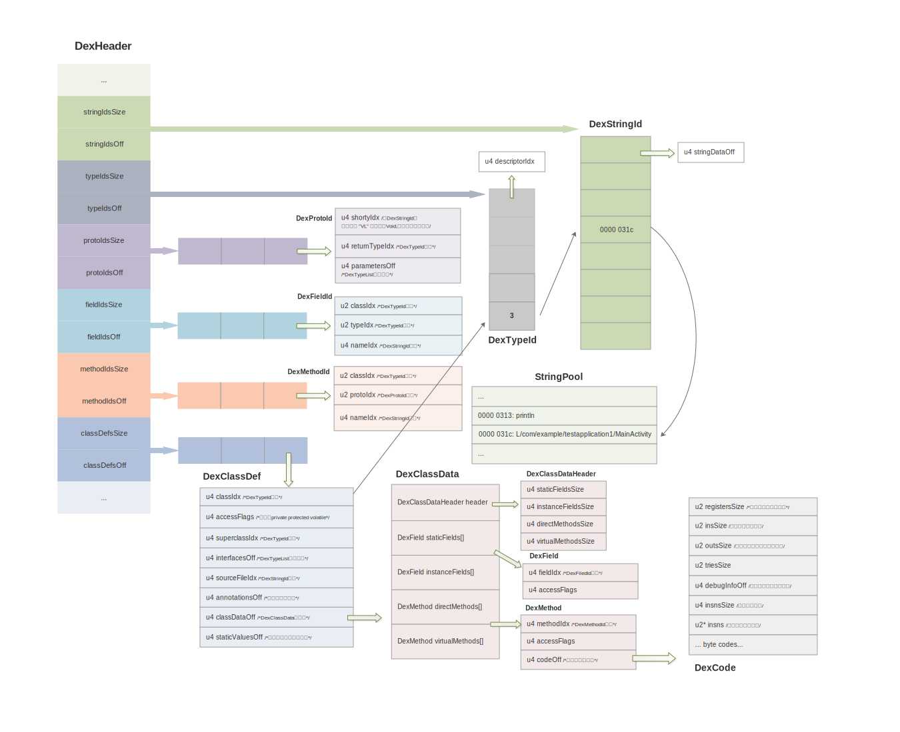

## Dalvik 字节码场景分析 ##

### Dex 文件结构 ###

#### Java -> Dex -> Dex Dump ####

	public class MainActivity extends Activity {
	
	    static Activity world;
	
	    boolean isDebug;
	
	    @Override
	    protected void onCreate(Bundle savedInstanceState) {
	        super.onCreate(savedInstanceState);
	
	        setContentView(R.layout.activity_main);
	
	        synchronized (MainActivity.class) {
	            world = this;
	        }
	
	        isDebug = BuildConfig.DEBUG;
	    }
	}
	
生成的`.dex`文件用`dexdump`解析 `./dexdump -d app-debug-1/classes.dex`得到`onCreate`函数的字节码如下：

	  Virtual methods   -
	    #0              : (in Lcom/example/testapplication1/MainActivity;)
	      name          : 'onCreate'
	      type          : '(Landroid/os/Bundle;)V'
	      access        : 0x0004 (PROTECTED)
	      code          -
	      registers     : 4
	      ins           : 2
	      outs          : 2
	      insns size    : 22 16-bit code units
	000434:                                        |[000434] com.example.testapplication1.MainActivity.onCreate:(Landroid/os/Bundle;)V
	000444: 6f20 0100 3200                         |0000: invoke-super {v2, v3}, Landroid/app/Activity;.onCreate:(Landroid/os/Bundle;)V // method@0001
	00044a: 1500 037f                              |0003: const/high16 v0, #int 2130903040 // #7f03
	00044e: 6e20 0600 0200                         |0005: invoke-virtual {v2, v0}, Lcom/example/testapplication1/MainActivity;.setContentView:(I)V // method@0006
	000454: 1c00 0400                              |0008: const-class v0, Lcom/example/testapplication1/MainActivity; // type@0004
	000458: 1d00                                   |000a: monitor-enter v0
	00045a: 6902 0700                              |000b: sput-object v2, Lcom/example/testapplication1/MainActivity;.world:Landroid/app/Activity; // field@0007
	00045e: 1e00                                   |000d: monitor-exit v0
	000460: 6300 0200                              |000e: sget-boolean v0, Lcom/example/testapplication1/BuildConfig;.DEBUG:Z // field@0002
	000464: 5c20 0600                              |0010: iput-boolean v0, v2, Lcom/example/testapplication1/MainActivity;.isDebug:Z // field@0006
	000468: 0e00                                   |0012: return-void
	00046a: 0d01                                   |0013: move-exception v1
	00046c: 1e00                                   |0014: monitor-exit v0
	00046e: 2701                                   |0015: throw v1

每一个方法都对应一个`DexCode`对象，该对象尾部跟随内容就是方法内字节码，字节码查询手册：

[Dalvik-Bytecode](https://source.android.com/devices/tech/dalvik/dalvik-bytecode)

[Dalvik-Executable-Instruction-Format](https://source.android.com/devices/tech/dalvik/instruction-formats)

### Dexdump 具体分析 ###

* 文件偏移 0444 位置：低位 `6f` 为操作码，查询指令编码ID为 `35c`, 格式为 `A|G|op BBBB F|E|D|C`，语法规则：

		[A=5] op {vC, vD, vE, vF, vG}, meth@BBBB
		[A=5] op {vC, vD, vE, vF, vG}, site@BBBB
		[A=5] op {vC, vD, vE, vF, vG}, type@BBBB
		[A=4] op {vC, vD, vE, vF}, kind@BBBB
		[A=3] op {vC, vD, vE}, kind@BBBB
		[A=2] op {vC, vD}, kind@BBBB
		[A=1] op {vC}, kind@BBBB
		[A=0] op {}, kind@BBBB

	* 指令ID第一位`3`代表字节指令共3个字节，虚拟机读取字节码时，通过查询“操作码-长度对应表”来截断指令长度
	* 指令ID第二位`5`代表指令最多用到5个寄存器
	* 指令ID第三位`c`代表常量池索引，`6f`操作码没有用到？

	解析`6f20 0100 3200` 得到如下:
	
		[A=2] invoke-super {C=2, D=3} kind@0001

	解释：调用父类函数，函数在 DexMethodId 表中的索引为1，传入两个参数，两个参数分别放在v2 v3寄存器，分别代表 this 对象，savedInstanceState 对象
		
* 文件偏移 0441 位置：低位 `15` 为操作码，查询指令编码ID为 `21h`, 格式为 `AA|op BBBB`, 语法规则：

		op vAA, #+BBBB0000

	解析`1500 037f`得到：`const/high16(move high 16bit) v0, 7f030000` 将常数 `0x7f030000` 移动到 `v0` 寄存器，这里 `0x7f030000` 就是 `activity_main.xml` 的资源ID。
	
* 后续注意 `synchronized` 关键字会插入 `monitor-enter` `monitor-exit` 指令，这两个指令不同的虚拟机都会做针对性优化，Dalvik虚拟机会有 `thin lock` `fat lock` 的转换。
* `iget-*``sget-*``iput-*``sput-*` 指令虚拟机在链接类时都会做优化，更换操作码，并直接定位到已经解析过的`ClassObject.Field[]`的内存地址，这样虚拟机在执行时，不用再做`DexFieldId` `DexTypeId` `DexStringId`查找。
	
> **Dex文件如何做到动态引用外部类内容的？**
> 
> Linux上的elf可执行文件内包含外部库相关函数的签名（声明），可执行文件运行时执行`dlopen``dlsym`，找到函数签名对应的函数地址，
> 
> Dex可执行文件引用的外部类、外部类内部变量、外部类内部函数都会在本Dex文件中存放`DexTypeId``DexFieldId``DexMethodId`中
