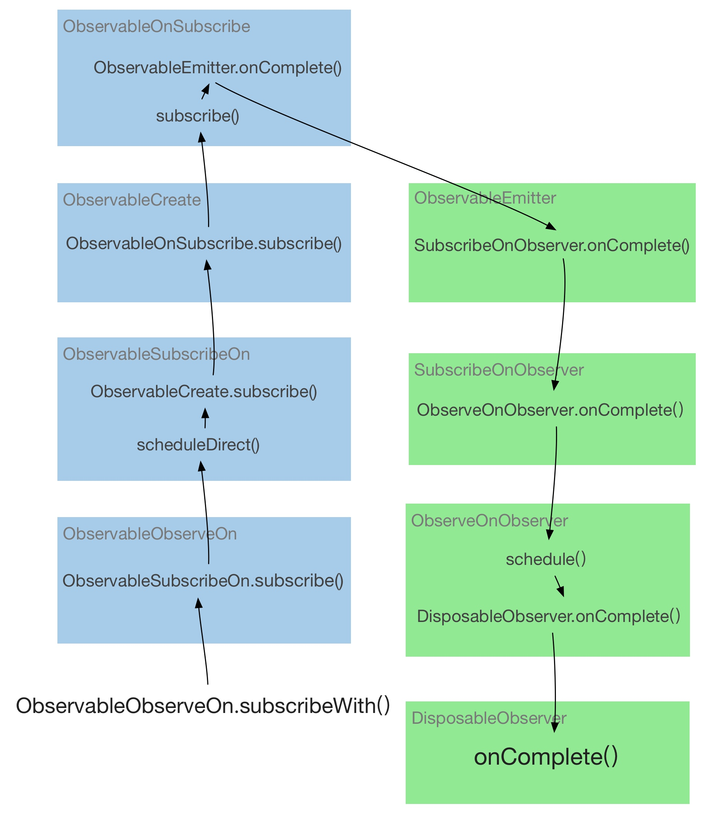

## RxJava ##

RxJava是一种响应式编程，适合客户端做UI和网络等方便的响应，RxJava也可以理解为事件流编程，可以将一个事件流分成多个事件流处理，也可以将多个事件流合成一个处理。相比与传统的`callback`回调嵌套，在代码简介和便于理解方便又很大帮助。

### 异步执行原理 ###
以一个RxAndroid异步流程代码举例来理解其内部实现：
	
	Observable.create(new ObservableOnSubscribe<String>() {
	            @Override
	            public void subscribe(ObservableEmitter<String> emitter) {
	                SystemClock.sleep(2000);
	                emitter.onNext("Hello");
	                emitter.onComplete();
	            }
	        }).subscribeOn(Schedulers.io())
	                .observeOn(AndroidSchedulers.mainThread())
	                .subscribeWith(new DisposableObserver<String>() {
	                    @Override public void onComplete() {
	                        Log.d(TAG, "onComplete()");
	                    }
	
	                    @Override public void onError(Throwable e) {
	                        Log.e(TAG, "onError()", e);
	                    }
	
	                    @Override public void onNext(String string) {
	                        Log.d(TAG, "onNext(" + string + ")");
	                    }
	                });

相应的原理图：

上面蓝色框类代表`Observable`，即被观察者，绿色框类代表`Observer`，即观察者。

类似`Builder`的方式,上面函数：`create``subscribeOn``observeOn`，每个都会返回`Observable`对象，不过不同于`Builder`每次返回`this`，这三个方法每次返回不同的`Observable`对象，分别为：`ObservableCreate``ObservableSubscribeOn``ObservableObserveOn`。
下层的`Observable`对象包含上层的`Observable`对象。`ObservableCreate`对象内通过`source`字段保存`ObservableOnSubscribe`对象，一层一层嵌套，最外面`subscribeWith`函数内部访问的是`ObservableObserveOn`对象，注意`subscribeOn`函数同时传入`Observer`对象。
`subscribeWith`内部主要执行下面代码：

    Scheduler.Worker w = scheduler.createWorker();

    source.subscribe(new ObserveOnObserver<T>(observer, w, delayError, bufferSize));
    
 可以看到在`new``ObserveOnObserver`对象时，同时把`subscribeWith`传入的最外层`Observer`对象给保存在`ObserveOnObserver`对象中。当然`ObserveOnObserver`也会保存在上一层的`SubscribeOnObserver`对象中，这样`observer`对象层层嵌套，任务完毕，`onCompelete`函数自上向下传递。
 
 上述代码`subscribeOn(Schedulers.io())``observeOn(AndroidSchedulers.mainThread())`一起实现了`AsyncTask`的异步执行机制。
`subscribeOn`函数内部通过`IoScheduler`的`ScheduledThreadPoolExecutor`实现异步线程执行`Runnable`，`Runnable`内部调用`ObservableCreate.subscribe`。
当`ObserveOnObserver.onComplete`执行时，需要切换到`AndroidSchedulers.mainThread()`(UI线程)，这里调用`HandlerScheduler`的`schedule()`函数。

    //AndroidSchedulers.java
	static final Scheduler DEFAULT
	            = new HandlerScheduler(new Handler(Looper.getMainLooper()), false);

    //HandlerScheduler.java
    public Disposable schedule(Runnable run, long delay, TimeUnit unit) {
        ...
        ScheduledRunnable scheduled = new ScheduledRunnable(handler, run);

        Message message = Message.obtain(handler, scheduled);
        message.obj = this; // Used as token for batch disposal of this worker's runnables.

        handler.sendMessageDelayed(message, unit.toMillis(delay));
        ...
        return scheduled;
    }

可以看到`HandlerScheduler`内部通过向主线程`handler`发消息实现`onCompelete`函数切换。

#### 异步返回值处理 ####

	  public void startLongOperation() {
	    DisposableObserver<Boolean> d = _getDisposableObserver();
	
	    _getObservable()
	        .subscribeOn(Schedulers.io())
	        .observeOn(AndroidSchedulers.mainThread())
	        .subscribe(d);
	
	    _disposables.add(d);
	  }
	
	  private Observable<Boolean> _getObservable() {
	    return Observable.just(true)
	        .map(
	            aBoolean -> {
	              _log("Within Observable");
	              _doSomeLongOperation_thatBlocksCurrentThread();
	              return aBoolean;
	            });
	  }
		  
	private DisposableObserver<Boolean> _getDisposableObserver() {
		return new DisposableObserver<Boolean>() {
		  @Override
		  public void onComplete() {}
		
		  @Override
		  public void onError(Throwable e) {}
		
		  @Override
		  public void onNext(Boolean bool) {}
		};
	}
	
上例中`map`异步函数执行返回的`aBoolean`值不是通过`RunnableFuture`的`get()`实现，而是通过`onNext`回调实现，在`map`函数结束后，自上而下会调用`onNext`方法，参数`aBoolean`，到了`ObserveOnObserver`时就遇到了一点小麻烦，这是先把`aBoolean`值保存到`ObserveOnObserver`成员`SimpleQueue<T> queue`中去，在`onNext`内部`schedule()`的`Runnable`中从`queue`中取出数据，然后再调用下一层的`onNext`。